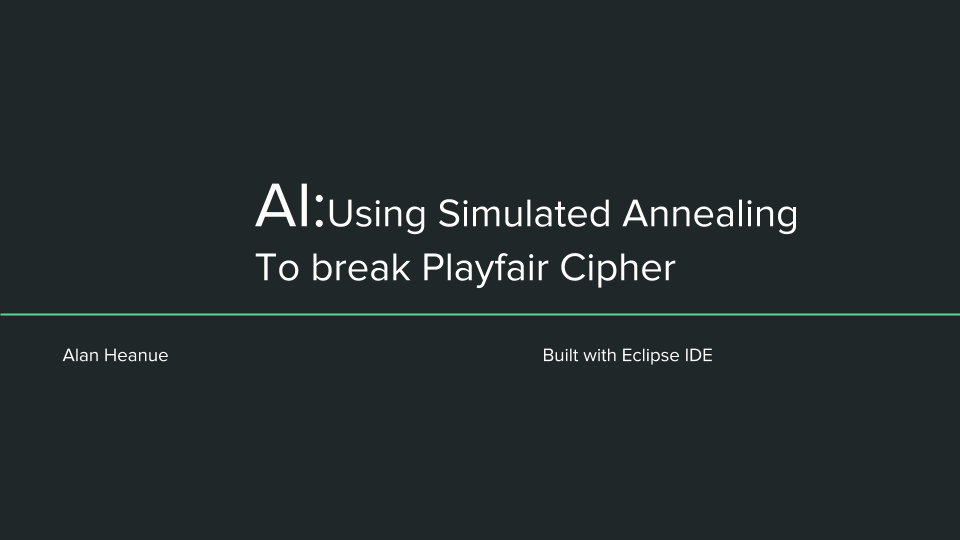
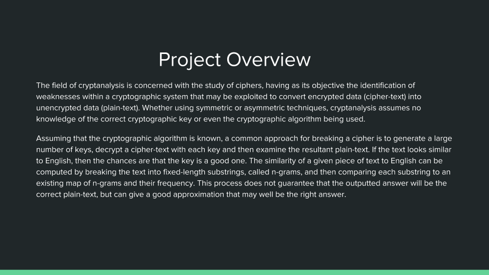
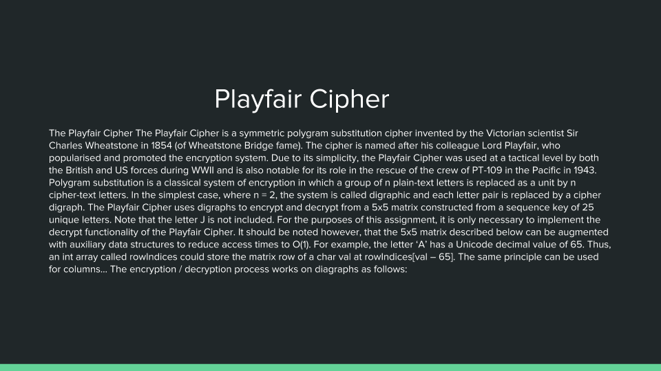
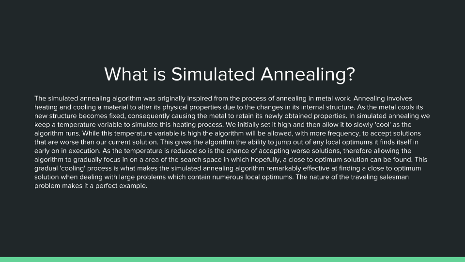
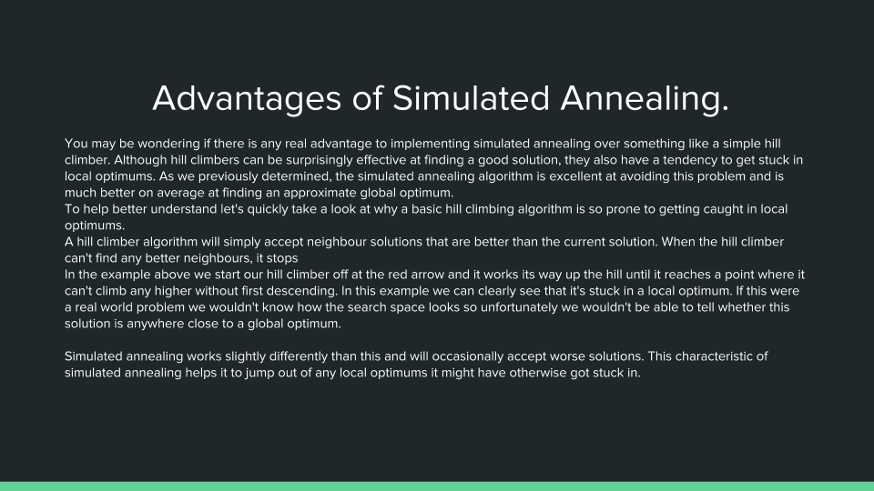
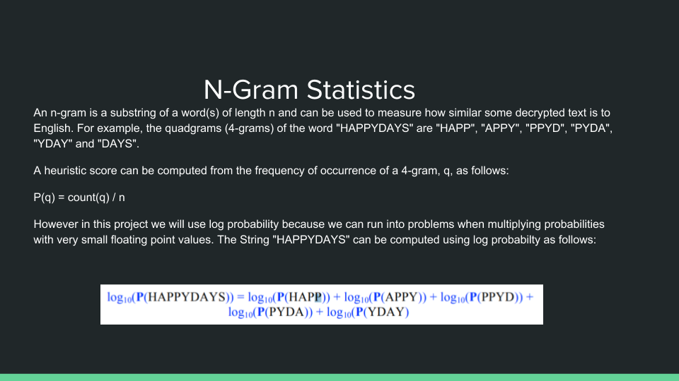
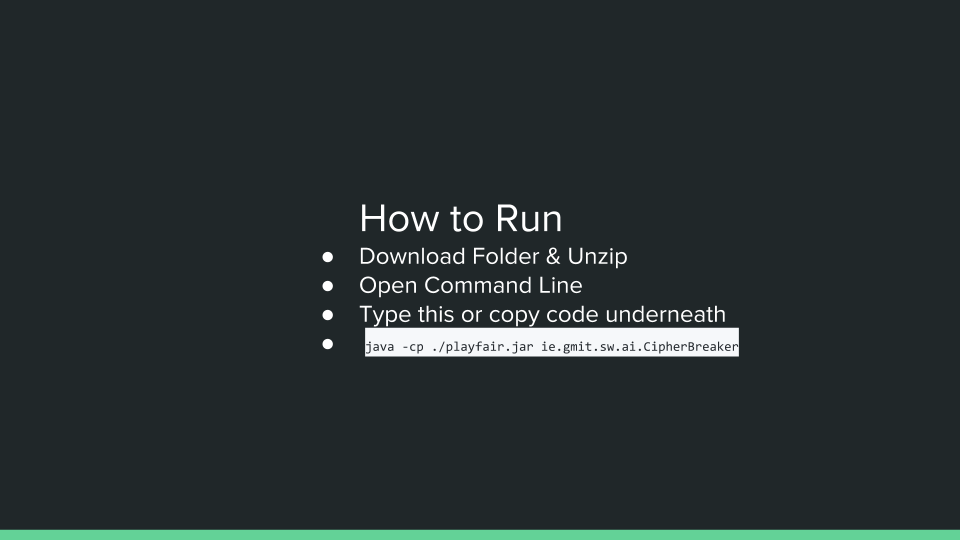

[](http://hits.dwyl.com/{username}/{project-name})
[](https://javadocio-badges.herokuapp.com/net.moznion/mysql-diff)

[](https://travis-ci.org/anfederico/Clairvoyant)
[](https://forthebadge.com)

**__**

**__**

**__**

**__**


# **_Code For Simulated Annealing_**
[](https://forthebadge.com)
```Java

public class SimulatedAnnealing {
	//variables 
	private Key key;
	private Playfair playFair;
	private SecureRandom rand;
	private int transitions;
	private Freq grams;
	private int temp;
	
	private Map<String, Integer> gramsMap; 
	
	//Constructor
	public SimulatedAnnealing(int temp, int transitions, String cipherText)
	{
		super();
		this.grams = new Freq("4grams.txt");
		this.playFair = new Playfair();
		//this.playFair.settextCip(textCip);
		this.playFair.setCipherText(cipherText);
		this.key = Key.keyInstance();
		this.setTemp(temp);
		this.transitions = transitions;
	}// end sa 
	//gets and sets 
		public Map<String, Integer> getGramsMap() {
			return gramsMap;
		}
		public void setGramsMap(Map<String, Integer> gramsMap) {
			this.gramsMap = gramsMap;
		}
		public int getTemp() {
			return temp;
		}
		public void setTemp(int temp) {
			this.temp = temp;
		}
	public void annealing(boolean debug) throws Throwable
	{		
		setGramsMap(grams.loadGrams());
		String parent = key.generateKey();
		String decryptedText = playFair.decrypt(parent);
		//score the fitness 
		double parentScore = grams.scoreText(decryptedText);
		double bestScore = parentScore;
		double probability;
		rand = new SecureRandom();
		double startScore = bestScore;
		for(@SuppressWarnings("unused")
		int temp1 = temp; temp > 0; temp--) {
			//Loop for each transition
			for (int index = transitions; index > 0; index--) {
				String child = key.shuffleKey(parent);
				decryptedText = playFair.decrypt(child);
				double childScore = grams.scoreText(decryptedText);
				double delta = childScore - parentScore;
				
				if
				(delta > 0)
				{
					parent = child;
					parentScore = childScore;
					}
				else 
				{
					probability = (Math.exp((delta / temp)));
					
					
					if
					(probability > rand.nextDouble()) {
						parent = child;
						parentScore = childScore;
					}
				}

				if(parentScore > bestScore) {
					//Save bescScore
					bestScore = parentScore;
					if(debug == true) System.out.printf("\nTemp: %d Transition: %d Key: %s Score: %.2f", temp, index, parent, bestScore);
				}
			}

			if(bestScore > (startScore/1.5)){
				if(debug == true) System.out.printf("\n\n Temp: %d Key: %s Score: %.2f\n\n", temp, parent, bestScore);
				if(bestScore > (startScore/1.6)) break;
			}
		}
		
		System.out.println("\n\nKey found: " + parent + "\nDecrypted message: " + playFair.decrypt(parent));
		try (PrintWriter out = new PrintWriter("result.txt"))
		{
		    out.println("Key found: " + parent + "\r\nDecrypted message: " + playFair.decrypt(parent));
		}//try
	}//end annealing
}//end class 
```

**__**

**__**

# **_Code to measure the fitness_**
[](https://forthebadge.com)
```Java
public double scoreText(String cipherText) {
		double score = 0;
		int frequency = 0;
		
		//loop through the cipher every 4 letters..
		for(int i=0; i< cipherText.length() - 4; i++){
			if(grams.get(cipherText.substring(i, i+4)) != null){
				frequency = grams.get(cipherText.substring(i, i+4));
			}
			
			else	
			{frequency = 1;}
			//log probability
			score += Math.log10((double) frequency/this.getNo());
		}//end for 
		return score;
	}//end class 
```
**__**

**__**
```
java -cp ./playfair.jar ie.gmit.sw.ai.CipherBreaker
```
# **_References_**
- https://github.com/northgc/playfair/blob/master/playfair.java
- https://github.com/ugljesas/playfair/tree/master/playfair
- https://www.researchgate.net/publication/220615701_Breaking_Short_Playfair_Ciphers_with_the_Simulated_Annealing_Algorithm
- https://stackoverflow.com/questions/10390254/how-do-you-write-a-string-to-a-text-file/10390351#10390351
- http://www.theprojectspot.com/tutorial-post/simulated-annealing-algorithm-for-beginners/6

[](https://forthebadge.com)

:octocat: :octocat: :octocat: :octocat:
<br/>
<div align="right">
    <b><a href="#----">↥ back to top</a></b>
</div>
<br/>